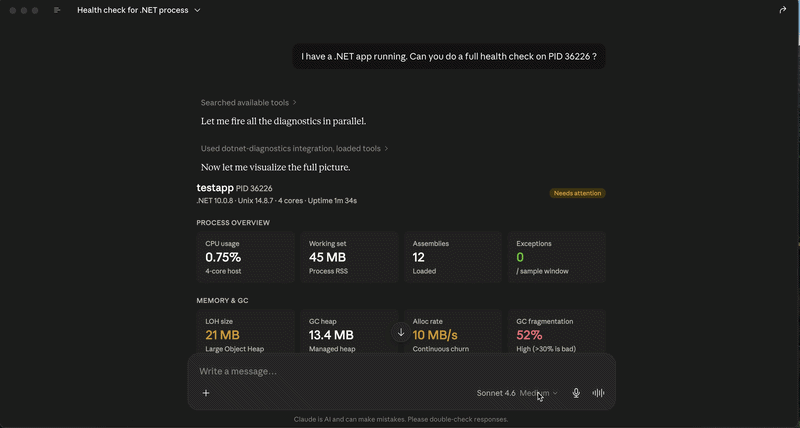

# mcp-dotnet-diagnostics

Give your AI assistant real-time visibility into your .NET application's runtime health.

Connect this [Model Context Protocol](https://modelcontextprotocol.io) server to Claude Desktop
and ask plain questions about any running .NET process — memory leaks, GC pressure, thread
starvation, allocation hotspots. Claude calls the right tools, reads real runtime data, and
tells you what's actually wrong.

---

## What this looks like in practice



You ask:
> *"Why does my API have high memory usage? PID is 12345."*

Claude calls `get_process_info` to confirm connectivity, then `get_memory_stats`, then
`get_gc_events` — and responds:

> *"Every GC event in the last 5 seconds was a Gen2 collection triggered by `AllocLarge`.
> Something is continuously allocating objects above the 85KB LOH threshold at ~10.5 MB/s.
> LOH is never compacted by default — fragmentation is at 55% and growing. The fix is
> `ArrayPool<byte>.Shared`. Rent a buffer, use it, return it."*

You don't tell Claude which tools to call. It figures that out from your question.

---

## Tools

| Tool | What it returns | Reach for it when... |
|------|----------------|----------------------|
| `get_process_info` | Name, PID, uptime, .NET version, OS | Starting any investigation — confirms the process is reachable |
| `get_memory_stats` | GC heap, LOH size, alloc rate, Gen0/1/2 counts, fragmentation | Memory is high or growing |
| `get_gc_events` | Per-collection timeline — generation, reason, timestamp | GC pauses are affecting latency |
| `get_thread_stats` | ThreadPool count, queue depth, completed items, lock contention | Requests are slow or backing up |
| `get_event_counters` | All 27 `System.Runtime` metrics in one snapshot | You want a broad health overview |
| `get_environment_info` | Runtime config, filtered env vars (no secrets) | Debugging configuration issues |
| `list_counters` | Raw EventCounter names and current values | Discovering what's available on an unfamiliar process |

---

## Installation

**1. Install the tool**

```bash
dotnet tool install -g mcp-dotnet-diagnostics
```

Requires .NET 8 SDK or later. [Get it here](https://dotnet.microsoft.com/download) if needed.

**2. Add to Claude Desktop**

Open `~/Library/Application Support/Claude/claude_desktop_config.json` while Claude Desktop
is **fully quit** (Cmd+Q — not just the window closed), then add:

```json
{
  "mcpServers": {
    "dotnet-diagnostics": {
      "command": "mcp-dotnet-diagnostics",
      "env": {
        "TMPDIR": "/var/folders/xx/your-tmpdir/T/"
      }
    }
  }
}
```

**3. Reopen Claude Desktop**

The `dotnet-diagnostics` connector appears in the tools menu. Ask it about any .NET process.

---

> **macOS: the `TMPDIR` step is not optional.**
>
> The .NET diagnostics protocol finds processes through a Unix socket. On macOS, that socket
> lives under `$TMPDIR` — not `/tmp/` where the library looks by default. Without this,
> every tool call returns "process not found."
>
> Find yours with: `echo $TMPDIR`

---

> **Want to contribute or build from source?**
> See [CONTRIBUTING.md](CONTRIBUTING.md) for how to clone, build, and add new tools.
## Usage

Find the PID of your target process:

```bash
dotnet-counters ps
```

Then ask Claude naturally:
"Do a full health check on PID 12345."
"Why is memory climbing on PID 12345?"
"Any thread starvation in PID 12345?"
"What's the GC situation on PID 12345?"

---

## How it works

The server uses `Microsoft.Diagnostics.NETCore.Client` to attach to any running .NET process
by PID — the same library that powers `dotnet-counters`, `dotnet-trace`, and `dotnet-dump`.
It streams telemetry directly from the CLR over EventPipe, which means you get the same data
as the official .NET CLI tools, available to Claude as structured tool responses.

The tool descriptions are written to guide Claude's investigation sequence. When you report
high memory, Claude calls `get_process_info` first (connectivity), then `get_memory_stats`
(heap overview), then `get_gc_events` (collection details) — because the descriptions say to.
The chaining is implicit, not hardcoded.

---

## Requirements

- .NET 8 SDK or later to build; .NET 10 recommended
- Claude Desktop or any MCP-compatible client
- A running .NET process to inspect (your app, an API, anything)

---

## Tests

```bash
dotnet test src/McpDotnetDiagnostics.Tests
```

34 tests across all 7 tools — unit tests against invalid PIDs, integration tests against the
live test runner process (`Environment.ProcessId`). Runs in ~17 seconds.

---

## Design decisions

Three decisions shaped this project in ways that aren't obvious from the outside:

- [ADR-001: C# over TypeScript](docs/adr-001-csharp-over-typescript.md) — the diagnostics library is .NET-native; a TypeScript wrapper would mean shelling out
- [ADR-002: Target process by PID, not self](docs/adr-002-target-process-diagnostics.md) — the MCP server itself is uninteresting; your API is where the real data lives
- [ADR-003: .NET 10 EventPipe payload extraction](docs/adr-003-dotnet10-payload-extraction.md) — undocumented payload structure change in .NET 10, discovered through runtime inspection

---

## License

MIT